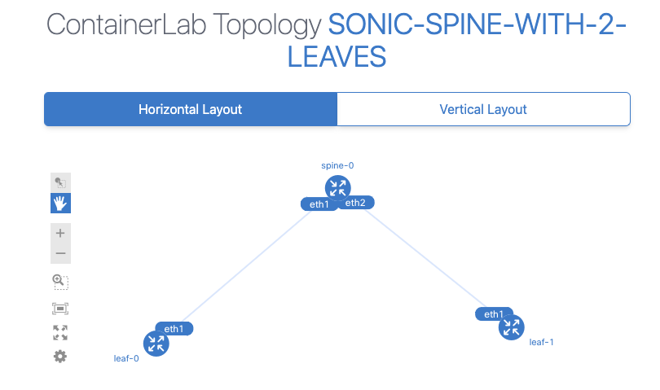
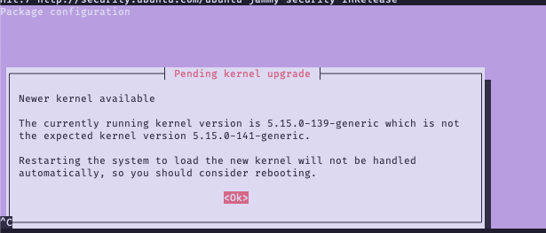

# Deploying SONiC-VS on ContainerLab

> Containerlab provides a CLI for orchestrating and managing container-based networking labs. It starts the containers, builds a virtual wiring between them to create lab topologies of users choice and manages labs lifecycle.


Based on the [official quickstart](https://containerlab.dev/quickstart/).

## Installing ContainerLab

```bash
# Download and run installation script
curl -sL https://containerlab.dev/setup | sudo -E bash -s "all"

# Add your user to the admin group.
sudo usermod -aG clab_admins $(whoami)

# Either logout and login again, or run this in order to apply the group to your session:
newgrp clab_admins
```

## Deploying a topology

`containerlab` uses files with a `.clab.yml` extension to describe topologies to deploy.
The installation comes with plenty of examples in the `/etc/containerlab/lab-examples/` directory.

One example-file, `/etc/containerlab/lab-examples/sonic01/sonic01.clab.yml` describes a topology with a SONiC switch and a Nokia switch
interconnected using a single link.

As-is, the file is not runnable due to Docker-registry permissions;
but we can create our own file referring to the Docker-image we've built locally and loaded.

Note that `containerlab` generally work with Docker-containers, but there _is_ a solution to work
a SONiC-VM.

### Using SONiC-VS (Container)

> [!NOTE]
> Adapted from [`containerlab` SONiC Container](https://containerlab.dev/manual/kinds/sonic-vs/)

Let's create our own `.clab.yml` file with a simple spine/leaf topology:
```yml
# sonic-spine-leaf.clab.yml
name: sonic-spine-with-2-leaves

topology:
  nodes:
    spine-0:
      kind: sonic-vs
      image: docker-sonic-vs:latest
    leaf-0:
      kind: sonic-vs
      image: docker-sonic-vs:latest
    leaf-1:
      kind: sonic-vs
      image: docker-sonic-vs:latest

  links:
    - endpoints: ["spine-0:eth1", "leaf-0:eth1"]
    - endpoints: ["spine-0:eth2", "leaf-1:eth1"]
```

And deploy it with:
```bash
$ containerlab deploy -t sonic-spine-leaf.clab.yml
10:13:43 INFO Containerlab started version=0.68.0
10:13:43 INFO Parsing & checking topology file=sonic-spine-leaf.clab.yml
10:13:43 INFO Creating lab directory path=/home/dn/src/topo/clab-sonic-spine-with-2-leaves
10:13:44 INFO Creating container name=leaf-1
10:13:44 INFO Creating container name=leaf-0
10:13:44 INFO Creating container name=spine-0
10:13:46 INFO Created link: spine-0:eth2 ▪┄┄▪ leaf-1:eth1
10:13:46 INFO Created link: spine-0:eth1 ▪┄┄▪ leaf-0:eth1
10:13:46 INFO Adding host entries path=/etc/hosts
10:13:46 INFO Adding SSH config for nodes path=/etc/ssh/ssh_config.d/clab-sonic-spine-with-2-leaves.conf
╭────────────────────────────────────────┬────────────────────────┬─────────┬───────────────────╮
│                  Name                  │       Kind/Image       │  State  │   IPv4/6 Address  │
├────────────────────────────────────────┼────────────────────────┼─────────┼───────────────────┤
│ clab-sonic-spine-with-2-leaves-leaf-0  │ sonic-vs               │ running │ 172.20.20.4       │
│                                        │ docker-sonic-vs:latest │         │ 3fff:172:20:20::4 │
├────────────────────────────────────────┼────────────────────────┼─────────┼───────────────────┤
│ clab-sonic-spine-with-2-leaves-leaf-1  │ sonic-vs               │ running │ 172.20.20.2       │
│                                        │ docker-sonic-vs:latest │         │ 3fff:172:20:20::2 │
├────────────────────────────────────────┼────────────────────────┼─────────┼───────────────────┤
│ clab-sonic-spine-with-2-leaves-spine-0 │ sonic-vs               │ running │ 172.20.20.3       │
│                                        │ docker-sonic-vs:latest │         │ 3fff:172:20:20::3 │
╰────────────────────────────────────────┴────────────────────────┴─────────┴───────────────────╯
```

### Using SONiC-VS (VM)

> [!NOTE]
> Adapted from - [`containerlab` SONiC-VM](https://containerlab.dev/manual/kinds/sonic-vm/)

`containerlab` only directly works with container, which means that all we need in order to work with 
a VM is a container-image that starts it.

Fortunately, there's a project called [`vrnetlab`](https://github.com/hellt/vrnetlab/tree/master/sonic) which fills this gap.
Follow the instructions in the linked page to build a Docker-image with a bundled VM image, and deploy a modified topology:

```yml
# vm-sonic-spine-leaf.clab.yml
name: sonic-spine-with-2-leaves

topology:
  nodes:
    spine-0:
      kind: sonic-vm
      image: vrnetlab/sonic_sonic-vs:drivenets
    leaf-0:
      kind: sonic-vm
      image: vrnetlab/sonic_sonic-vs:drivenets
    leaf-1:
      kind: sonic-vm
      image: vrnetlab/sonic_sonic-vs:drivenets

  links:
    - endpoints: ["spine-0:eth1", "leaf-0:eth1"]
    - endpoints: ["spine-0:eth2", "leaf-1:eth1"]
```

This approach requires rebuilding the vrnetlab image every time we rebuild the SONiC image.
To work around it, we've [forked the repository](https://github.com/gnaaman-dn/vrnetlab/tree/master/sonic-dev) to create an image with a volume-able SONiC image.

This generic image is available at the `dn19` registry, which I assume is going to be named that forever. (/s)
In order to use it, create a topology with a bind-mount to a directory containing the `.img` file.

```yml
name: sonic-spine-with-2-leaves

topology:
  nodes:
    spine-0:
      kind: sonic-vm
      image: dn19.dev.drivenets.net:5000/sonic_vs:generic
      binds:
        - .:/img/:ro
    leaf-0:
      kind: sonic-vm
      image: dn19.dev.drivenets.net:5000/sonic_vs:generic
      binds:
        - .:/img/:ro
    leaf-1:
      kind: sonic-vm
      image: dn19.dev.drivenets.net:5000/sonic_vs:generic
      binds:
        - .:/img/:ro

  links:
    - endpoints: ["spine-0:eth1", "leaf-0:eth1"]
    - endpoints: ["spine-0:eth2", "leaf-1:eth1"]
```


## Graphing a topology
`containerlab` comes with a useful subcommand called `graph`.

When in a directory with a `.clab.yml` file, you can run:
```bash
$ containerlab graph
10:45:52 INFO Parsing & checking topology file=sonic-spine-leaf.clab.yml
10:45:52 INFO Serving topology graph on http://0.0.0.0:50080
```

Open your browser and navigate to `http://YOUR-MACHINE-HOSTNAME:50080` to see an interactive graph.



## Common Installation Issues

### Terminal stuck at message saying that kernel doesn't match expected kernel



This warning appears because some recent `apt` operation upgraded the installed kernel,
but the system has not been rebooted yet to execute it.

This sort of warning-screen is usually just skippable when running `apt`,
but since the installation script runs `apt` noninteractively, you cannot press `<Ok>`.

In order to resolve this, reboot your system and rerun the installation script.
